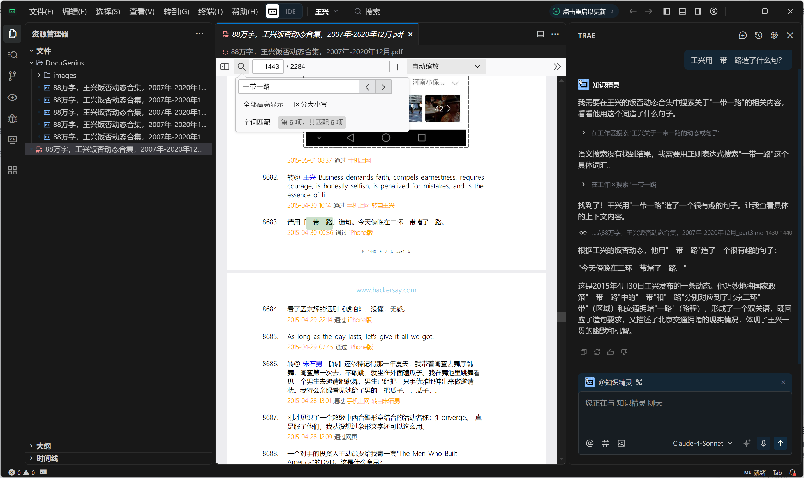

# DocuGenius | 文档精灵

🚀 **AI IDE 文档转换神器** - Claude Project 的完美平替！

自动将 AI IDE 中的 Word、Excel、PowerPoint 和 PDF 文件转换为 Markdown 格式，方便进行检索生成，以便支持深度检索生成，支持 Trae、CodeBuddy 等 AI IDE。作为 Claude Project 的平替，低成本使用 Claude Sonnet 4 以及 GPT-5 等超级模型。在 vibe coding 之余还能愉快 vibe writing！

## 🎯 为什么选择 DocuGenius？

### 💰 成本优势

- **Claude Project**: $20/月订阅费用
- **TRAE + DocuGenius**: 不到一半的价格，更高性价比

### 🚀 技术优势

- **🧠 智能规划与检索**: TRAE 的智能规划与检索 + DocuGenius 的文档转换 = 更强的检索效果
- **📁 本地知识库**: 随时随地将电脑本地文件夹转化为"知识库"，无需上传，方便维护

### 🤖 AI IDE 完美集成

- **TRAE**: 推荐使用，配套智能体「知识精灵」[点击复刻](https://s.trae.ai/a/15c750)
- **CodeBuddy**: 完美支持本地文件夹智能处理
- **VSCode + Augment**: 无缝集成强大的Augment Code
- **其他 AI IDE**: 广泛兼容各种基于VSCode的智能开发环境

### 🧠 智能检索生成

在 Trae 或 CodeBuddy 中打开你的本地文件夹即可开启智能旅程！DocuGenius + TRAE 的组合让 AI 能够：

**📖 文档理解**:

- 深度理解文档内容
- Excel 表格完整识别（Claude Project 不支持）
- 智能规划与检索能力，检索效果更强

**💻 代码开发**:

- 支持参考本地知识库内容生成代码
- 指哪打哪的精准修改，避免 Claude Artifact 代码量多时崩溃
- 精细化操作无瑕疵，稳定的代码编辑体验

**📁 知识库管理**:

- 本地文件夹即可转为知识库，无需手动构建
- 实时同步更新，保持知识库最新状态

## 💡 实际案例 | Real-World Example

### 🎯 88万字文档智能问答协作

**场景**: 处理大型技术文档，实现智能问答和深度协作



**案例亮点**:
- 📚 **超大文档处理**: 成功处理88万字的复杂文档
- 🤖 **智能问答**: 基于文档内容进行精准问答
- 🔍 **深度检索**: 快速定位关键信息和相关内容
- 💬 **协作对话**: 支持多轮对话，深入理解文档细节
- ⚡ **高效响应**: 即使面对海量内容，依然保持快速响应

**技术优势**:
- 🧠 **智能理解**: AI 能够理解文档的整体结构和逻辑关系
- 📊 **结构化处理**: 将复杂文档转换为 AI 友好的 Markdown 格式
- 🎯 **精准检索**: 基于语义理解，而非简单的关键词匹配
- 🔄 **上下文保持**: 在多轮对话中保持上下文连贯性

> 💡 **提示**: 这正是 DocuGenius + TRAE 组合的强大之处 - 让 AI 能够真正"理解"和"协作"处理大型文档！

## 📥 Download | 下载

[](https://github.com/brucevanfdm/DocuGenius/releases/latest)

**🚀 Get DocuGenius**: [GitHub Releases](https://github.com/brucevanfdm/DocuGenius/releases/latest)

**获取DocuGenius**: [GitHub发布页面](https://github.com/brucevanfdm/DocuGenius/releases/latest)

## ✨ 核心功能 | Core Features

### 🎯 AI IDE 专属优化

- **📄 全格式支持**: Word (.docx)、Excel (.xlsx)、PowerPoint (.pptx)、PDF (.pdf) → AI 友好的 Markdown
- **🧠 深度检索优化**: 转换后的文档完美适配 AI 检索生成，支持上下文理解
- **🖼️ 多模态支持**: 智能提取图片并生成相对路径引用（Word/PowerPoint）
- **📁 知识库组织**: 创建 `DocuGenius/` 统一知识库，方便 AI IDE 索引和检索

### 🚀 智能特性

- **🔄 实时同步**: 源文件修改时自动重新转换，保持知识库最新
- **⚡ 批量处理**: 一键处理整个文件夹，快速构建知识库
- **🎨 质量保证**: 保持原始图片质量，支持多种图片格式
- **🔍 智能过滤**: 自动跳过装饰性小图片，专注有价值内容

### 💡 平替优势

- **💰 成本节省**: 相比 Claude Project $20/月，使用成本不到一半
- **📊 功能增强**: 支持 Excel 文件识别（Claude Project 不支持）
- **🌐 生态兼容**: 支持 TRAE、CodeBuddy、VSCode+Augment 等多种 AI IDE

## 🚀 快速开始 | Quick Start

### 1. 安装插件 | Install Extension

1. **下载**: 访问 [GitHub发布页面](https://github.com/brucevanfdm/DocuGenius/releases/latest) 下载最新 `.vsix` 文件
2. **安装**: VS Code → 扩展(`Ctrl+Shift+X`) → "..." → "从VSIX安装..."
3. **选择**: 选择下载的 `.vsix` 文件

**Download**: Go to [GitHub Releases](https://github.com/brucevanfdm/DocuGenius/releases/latest) and download the latest `.vsix` file

### 2. 环境准备 | Environment Setup

**macOS**: 开箱即用！| Ready to use!

- **Intel Mac**: 原生支持，最佳性能
- **Apple Silicon Mac**: 通过 Rosetta 2 完全兼容，所有功能正常使用
  - 需要安装 Rosetta 2：`/usr/sbin/softwareupdate --install-rosetta`
  - 系统要求：macOS 11.0 (Big Sur) 或更高版本

**Windows**: Python 库会自动安装，确保已安装 Python ([python.org](https://python.org))

### 3. AI IDE 集成 | AI IDE Integration

#### 🎯 TRAE (推荐)

1. 安装 DocuGenius 并转换文档
2. 在 TRAE 中打开项目文件夹
3. 复刻「知识精灵」智能体：[https://s.trae.ai/a/15c750](https://s.trae.ai/a/15c750)
4. 开始智能对话和文档分析

#### 🤖 CodeBuddy

1. 使用 DocuGenius 构建 Markdown 知识库
2. 在 CodeBuddy 中导入项目文件夹
3. AI 自动索引 `DocuGenius/` 文件夹内容

#### 💻 VSCode + Augment

1. 安装 DocuGenius 扩展
2. 启用 Augment 插件
3. 文档自动转换并可被 Augment 检索

### 4. 开始使用 | Start Using

**首次使用**: 打开包含文档的文件夹 → 扩展询问启用 → 点击"启用"

**批量转换**: 右键文件夹 → "Process All Files in Folder" → 一键构建知识库

## 📖 How to Use | 使用方法

### Manual Conversion | 手动转换 (Recommended | 推荐)

- **Single file**: Right-click file → "Convert to Markdown"
- **Whole folder**: Right-click folder → "Process All Files in Folder"
- **单个文件**：右键文件 → "Convert to Markdown"
- **整个文件夹**：右键文件夹 → "Process All Files in Folder"

### Automatic Conversion | 自动转换 (Optional | 可选)

To enable automatic conversion: Go to Settings → Search "DocuGenius" → Turn on "Auto Convert"

要启用自动转换：进入设置 → 搜索"DocuGenius" → 开启"Auto Convert"

When enabled, new document files are automatically converted to the `DocuGenius/` folder

启用后，新文档文件会自动转换到 `DocuGenius/` 文件夹

## 📁 AI 友好的知识库结构 | AI-Friendly Knowledge Base

DocuGenius 为 AI IDE 创建完美的知识库结构：

```
your-project/
├── 原始文档/                        # 保持原始文件不变
│   ├── 产品需求.docx
│   ├── 数据分析.xlsx
│   ├── 项目汇报.pptx
│   └── 技术文档.pdf
└── DocuGenius/                     # AI 可检索的知识库
    ├── 产品需求.md                  # AI 友好的 Markdown 格式
    ├── 数据分析.md                  # 表格数据转换为结构化文本
    ├── 项目汇报.md                  # 幻灯片内容完整提取
    ├── 技术文档.md                  # PDF 内容精准转换（仅文字）
    └── images/                     # 智能图片组织（Word/PPT）
        ├── 产品需求/                # 按文档分类
        │   ├── page_1_img_1.png
        │   └── page_2_img_1.jpg
        └── 项目汇报/
            ├── slide_1_img_1.png
            └── slide_3_chart_1.png
```

### 🎯 AI IDE 优化特性

**📊 结构化数据**: Excel 表格转换为 AI 可理解的 Markdown 表格
**🖼️ 图文并茂**: 图片自动提取并生成相对路径引用（Word/PowerPoint）
**🔍 语义优化**: 内容结构化处理，提升 AI 理解准确度
**📝 上下文保持**: 保持文档原有的逻辑结构和层次关系

### 📋 支持格式 | Supported Formats

- **📄 Office 文档**: `.docx`, `.xlsx`, `.pptx` → 完整内容提取
- **📑 PDF 文件**: `.pdf` → 高质量文字提取（轻量化处理）
- **📝 文本文件**: `.txt`, `.md`, `.json`, `.csv`, `.xml` → 统一检索

## 🆚 对比优势 | Competitive Advantages

### DocuGenius + TRAE vs Claude Project

| 特性                     | DocuGenius + TRAE     | Claude Project      |
| ------------------------ | --------------------- | ------------------- |
| **💰 月费用**      | 10美金                | 20美金              |
| **📊 Excel 支持**  | ✅ 完整支持           | ❌ 不支持           |
| **🖼️ 图片提取**  | ✅ Word/PPT高质量提取 | ⚠️ 基础支持       |
| **📁 本地文件**    | ✅ 完全控制           | ❌ 需上传           |
| **🔄 实时同步**    | ✅ 自动更新           | ❌ 手动上传         |
| **🧠 智能检索**    | ✅ TRAE 智能规划增强  | ⚠️ 基础检索       |
| **💻 代码项目**    | ✅ 大规模项目支持     | ❌ Artifact 易崩溃  |
| **🎯 精准修改**    | ✅ 指哪打哪           | ❌ 精细化修改有瑕疵 |
| **📁 知识库**      | ✅ 本地文件夹即知识库 | ❌ 需手动构建       |
| **🎯 AI IDE 集成** | ✅ 多平台支持         | ❌ 仅 Claude        |
| **📈 扩展性**      | ✅ 开源可定制         | ❌ 封闭系统         |

### 使用场景对比

#### 🎯 最佳使用场景

- **📚 知识管理**: 大量文档需要 AI 检索分析，TRAE 智能规划提升检索效果
- **💻 代码开发**: 大规模项目代码编写，指哪打哪的精准修改，避免 Artifact 崩溃
- **💼 企业应用**: 本地部署，数据安全可控，随时将文件夹转为知识库
- **🔬 研究工作**: 学术论文、技术文档批量处理，多格式全面支持
- **📊 数据分析**: Excel 报表转换为 AI 可理解格式（Claude 不支持）
- **🎨 创意写作**: 在 vibe coding 之余愉快 vibe writing，原生代码支持

#### 💡 为什么选择 TRAE + DocuGenius

1. **💰 成本效益**: 相同功能，成本不到一半
2. **🚀 功能增强**: 支持更多格式，特别是 Excel；智能规划与检索能力更强
3. **🔒 数据安全**: 本地处理，无需上传敏感文档到云端
4. **💻 代码优势**: 原生为代码而生，大规模项目稳定，精细化修改无瑕疵
5. **📁 便捷性**: 本地文件夹即可转为知识库，无需手动构建
6. **🌐 生态开放**: 支持多种 AI IDE，不被单一平台绑定
7. **📈 持续更新**: 开源项目，功能持续迭代优化

## ⚙️ Settings | 设置

Access via `Ctrl+,` (Windows) or `Cmd+,` (Mac), then search "DocuGenius":

通过 `Ctrl+,` (Windows) 或 `Cmd+,` (Mac) 访问，然后搜索"DocuGenius"：

### Core Settings | 核心设置

- **Auto Convert | 自动转换**: Enable automatic conversion of new files (default: off)
- **Overwrite Existing | 覆盖现有**: Update converted files when source changes (default: on)
- **Extract Images | 提取图片**: Save images from documents (default: on)
- **Folder Name | 文件夹名**: Change output folder name (default: "DocuGenius")

### Advanced Settings | 高级设置

- **Supported Extensions | 支持扩展**: File types to monitor (default: .docx, .xlsx, .pptx, .pdf)
- **Copy Text Files | 复制文本**: Include text files in knowledge base (default: off)

## 🖼️ Image Extraction Features | 图片提取功能

DocuGenius automatically extracts images from your documents and organizes them intelligently:

DocuGenius 自动从文档中提取图片并智能组织：

### Supported Document Types | 支持的文档类型

- **PDF Files**: Uses pdfplumber for lightweight, high-quality text extraction
- **Word Documents (.docx)**: Extracts embedded images from document relationships
- **PowerPoint (.pptx)**: Extracts images from slides and shapes

**PDF 文件**：使用 pdfplumber 进行轻量化、高质量文字提取
**Word 文档 (.docx)**：从文档关系中提取嵌入图片
**PowerPoint (.pptx)**：从幻灯片和形状中提取图片

### Smart Organization | 智能组织

```
DocuGenius/
├── document.md
└── images/
    └── document/                   # Organized by document name
        ├── page_1_img_1.png       # From Word documents
        ├── page_1_img_2.jpg       # From Word documents
        ├── slide_1_img_1.png      # From PowerPoint
        └── slide_3_img_1.gif      # From PowerPoint
```

### Image Quality & Formats | 图片质量与格式

- **High Quality**: Maintains original image quality during extraction
- **Multiple Formats**: Supports PNG, JPEG, GIF, BMP formats
- **Smart Filtering**: Skips decorative images smaller than configured threshold
- **Collision-Free**: Automatic filename collision detection and resolution

**高质量**：提取过程中保持原始图片质量
**多种格式**：支持 PNG、JPEG、GIF、BMP 格式
**智能过滤**：跳过小于配置阈值的装饰性图片
**无冲突**：自动检测和解决文件名冲突

### Markdown Integration | Markdown 集成

Extracted images are automatically referenced in the generated Markdown:

提取的图片自动在生成的 Markdown 中引用：

```markdown
# Document Title

## Extracted Images


<!-- Images extracted: 5 images saved to DocuGenius/images/document -->
<!-- Note: PDF images are not extracted in lightweight mode -->
```

- **Show Notifications | 显示通知**: Popup when conversion completes (default: on)
- **Project Config | 项目配置**: Create .docugenius.json files (default: off)
- **Batch Behavior | 批量行为**: How to handle multiple files (default: ask once)

## 📊 Status Bar | 状态栏

Watch the bottom status bar for conversion progress:

观察底部状态栏的转换进度：

- **Ready** | **就绪**: Monitoring for new files | 监控新文件
- **Converting** | **转换中**: Processing a file | 正在处理文件
- **Done** | **完成**: Conversion successful | 转换成功
- **Error** | **错误**: Something went wrong | 出现错误

Click the status to see detailed logs | 点击状态查看详细日志

## 📦 Installation Requirements | 安装要求

### For Basic Document Conversion | 基本文档转换

- **Windows**: Python 3.6+ with basic libraries (auto-installed, ~16MB total)
  - `python-docx`: ~2.2MB (Word documents)
  - `openpyxl`: ~1.8MB (Excel files)
  - `python-pptx`: ~2.4MB (PowerPoint files)
  - `pdfplumber`: ~0.4MB (PDF files,)
- **macOS**: Built-in binary (no additional requirements)
  - **Apple Silicon Mac**: Native ARM64 support, optimal performance
  - **Intel Mac**: Native support, optimal performance
- **Linux**: Built-in binary (no additional requirements)

**Windows**：Python 3.6+ 及基础库（自动安装，总计约16MB）

- `python-docx`：约2.5MB（Word文档）
- `openpyxl`：约2.4MB（Excel文件）
- `python-pptx`：约2.5MB（PowerPoint文件）
- `pdfplumber`：约8.4MB（PDF文件，包含pdfminer依赖）

**macOS**：内置二进制文件（无额外要求）

- **Apple Silicon Mac**：原生 ARM64 支持，最佳性能
- **Intel Mac**：原生支持，最佳性能

**Linux**：内置二进制文件（无额外要求）

### 🔄 Automatic Dependency Installation | 自动依赖安装

**Windows系统会根据文件类型自动安装所需依赖：**

- 首次转换 `.docx`文件时自动安装 `python-docx`
- 首次转换 `.xlsx`文件时自动安装 `openpyxl`
- 首次转换 `.pptx`文件时自动安装 `python-pptx`
- 首次转换 `.pdf`文件时自动安装 `pdfplumber`

**Windows automatically installs required dependencies based on file type:**

- Auto-installs `python-docx` when first converting `.docx` files
- Auto-installs `openpyxl` when first converting `.xlsx` files
- Auto-installs `python-pptx` when first converting `.pptx` files
- Auto-installs `pdfplumber` when first converting `.pdf` files

### 🔧 Troubleshooting | 故障排除

**Conversion not working?** | **转换不工作？**

1. Check Output panel: `View → Output → DocuGenius`
2. Make sure Python is installed (Windows only)
3. Try manual conversion: Right-click file → "Convert to Markdown"
4. 检查输出面板：`查看 → 输出 → DocuGenius`
5. 确保已安装Python（仅Windows）
6. 尝试手动转换：右键文件 → "Convert to Markdown"

**Image extraction not working?** | **图片提取不工作？**

1. PDF image extraction is not supported (lightweight mode)
2. Check that image extraction is enabled in settings for Word/PowerPoint
3. Verify document contains extractable images (not just text)
4. PDF图片提取不支持（轻量化模式）
5. 检查设置中是否为Word/PowerPoint启用了图片提取
6. 验证文档包含可提取的图片（不仅仅是文本）
